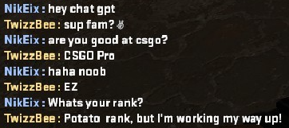

# pycsgogpt

**pycsgogpt** is a CSGO chatbot powered by OpenAI GPT-3.5 Turbo. It connects to a CSGO client via Telnet and uses the GPT-3.5 Turbo model to generate responses based on incoming messages from other players. The chatbot provides an interactive and fun experience by simulating human-like conversations in the game.




## Installation

```bash
pip install pycsgogpt
```

## Usage

First, add `-netconport 21234` to the launch options of your CSGO server. Then, start the server and run the following command:

```python
pycsgogpt <your_player_name> <your_openai_api_key> [--telnet-port <telnet_port>]
```

* player-name: Your CSGO player name.
* openapi-key: Your OpenAI API key.
* telnet-port (optional): The telnet port for the CSGO server (default: 21234).

## Contributing
Contributions are welcome! If you have any bug reports, feature requests, or suggestions, please open an issue or submit a pull request.

## License
This project is licensed under the MIT License. See [LICENSE](LICENSE) for more details.
